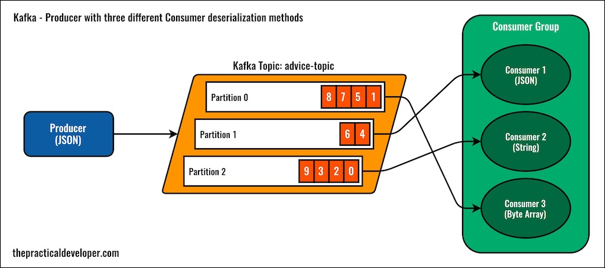

# Spring Boot Kafka Producer Consumber Example - The Practical Developer

## Basic configuration

This sample application shows how to use basic Spring Boot configuration to set up a producer to a topic with multiple partitions and a consumer group with three different consumers.

The complete post with details is on The Practical Developer website: [Spring Boot and Kafka - Practical Configuration Examples](https://thepracticaldeveloper.com/spring-boot-kafka-config/).

* See also PDF: https://github.com/charleshoanduong1111/kafka-spring-boot-producer-consumer-example/blob/master/documentation/Spring%20Boot%20and%20Kafka%20%E2%80%93%20Practical%20Example.pdf

## Multiple serialization / deserialization formats

To illustrate the different configuration options, this application deserializes Kafka messages in three different ways:

* As a JSON to Java object.
* As a simple String (plain JSON).
* As a byte array.

## Docker compose

This code includes a `docker-compose.yml` file, so you can use Docker Compose to start up Kafka without installing anything.

# Refer to
* https://github.com/charleshoanduong1111/kafka-spring-boot-producer-consumer-example/blob/master/documentation/1.%20how%20to%20download%20and%20run%20kafka.docx
* https://github.com/charleshoanduong1111/kafka-spring-boot-producer-consumer-example/blob/master/documentation/2.%20how%20to%20run%20docker%20engine%20and%20docker-compose%20up%20on%20window%2010.docx

## Was it useful?

Give a star to this project, and consider some extra readings:

* [My practical book about building a microservices architecture from scratch](https://amzn.to/3nADn4q).
* [The Full Reactive Stack Guide](https://leanpub.com/full-reactive/).
* [The Practical Architecture Guide](https://leanpub.com/practical-software-architecture).
